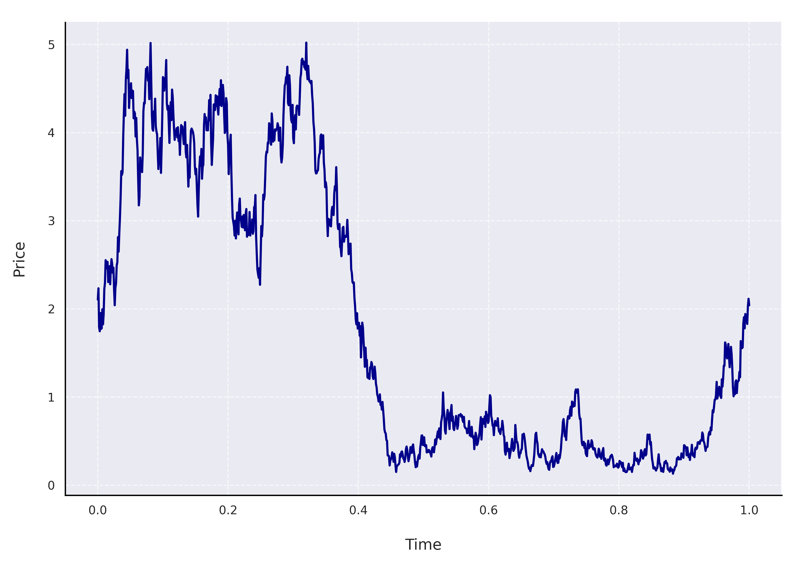
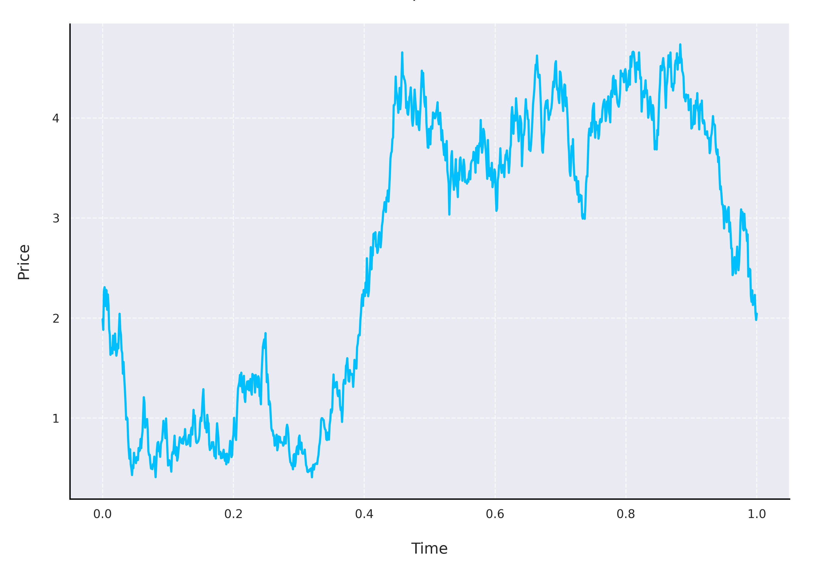

# About the mathematical models

 

## Stock prices

The [**Geometric Brownian motion (GBM)**](https://en.wikipedia.org/wiki/Geometric_Brownian_motion) is a mathematical framework used to describe the stochastic evolution of stock prices over time. As a continuous-time model based on stochastic calculus, it is widely applied in financial modeling.

### Model Definition

The price of a stock $S(t)$ at time $t$ under the GBM is described by the stochastic differential equation:

=\mu&space;S(t)dt&plus;\sigma&space;S(t)dW(t))

where:

- $S(t)$ : Stock price at time t
- $\mu$ : Drift coefficient (expected return rate of the stock)  
- $\sigma$ : Diffusion coefficient (volatility of the stock)  
- $W(t)$ : Standard Brownian motion

### Solution of the SDE

The analytical solution of the SDE for S(t) is given by:

=S(0)\hspace{2px}\exp\left\(\left(\mu-\frac{\sigma^2}{2}\right)t&plus;\sigma&space;W(t)\right\).)

For discrete time steps, the recursive version is hence given by:

=S(t)\exp\left(\left(\mu-\frac{\sigma^2}{2}\right)\Delta&space;t&plus;\sigma\Delta&space;W_t\right),\hspace{4em}\Delta&space;W_t\sim\mathcal{N}\left(0,\sqrt{\Delta&space;t}\right).)
   

## Option Prices

The [**Black-Scholes model**](https://en.wikipedia.org/wiki/Black%E2%80%93Scholes_model) is a mathematical model used for pricing options and derivatives. It was developed by economists Fischer Black, Myron Scholes, and Robert Merton in the early 1970s and is widely used in finance for estimating the theoretical price of options.

### Call Option Price Formula

The formula for the price of a European call option is:

-K\cdot&space;e^{-rT}\cdot&space;N(d_2),)

where:

&plus;(r&plus;\frac{\sigma^2}{2})\cdot&space;T}{\sigma\cdot\sqrt{T}},)

- $C$ : Price of the call option
- $S_0$ : Current price of the underlying asset
- $K$ : Strike price of the option
- $T$ : Time to maturity (in years)
- $r$ : Risk-free interest rate (annualized)
- $\sigma$ : Volatility of the underlying asset's returns
- $N(\cdot)$ : Cumulative distribution function of the standard normal distribution

### Put Option Price Formula

The formula for the price of a European put option is:

-S_0\cdot&space;N(-d_1))

where:
- $P$ : Price of the put option.
